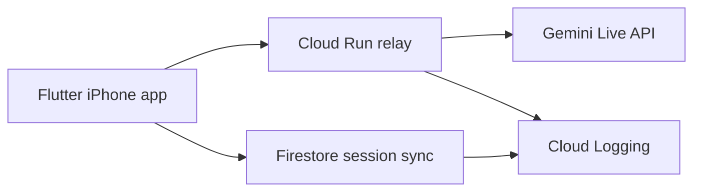

# AEyes

AEyes is an accessibility-first live visual assistant for blind and visually impaired users. It uses Gemini Live to combine live camera input, voice conversation, and safety-first spoken guidance. The app is built as a hackathon project and includes a Google Cloud backend so the agent is not just a local mobile demo.

## Project Summary

- product goal: help blind users understand surroundings, avoid hazards, and find objects
- interaction style: real-time voice + camera
- core differentiator: safety-first guidance, startup room scan, and scene memory
- hackathon angle: a hosted multimodal agent on Google Cloud, not just an on-device Gemini wrapper

## Main Features

- live Gemini voice interaction using microphone + camera
- spoken guidance for navigation and object search
- hazard-first prompting for stairs, floor obstacles, low objects, open doors, and other risks
- startup scan flow so the user can pan the phone and let the agent understand the room first
- session-scoped scene memory and transcript syncing
- Cloud Run websocket relay for Gemini Live
- Firestore-backed cloud session storage
- iOS-focused experience with camera, audio, and ARKit groundwork

## Tech Stack

### Mobile app

- `Flutter`
- `Dart`
- `camera`
- `record`
- `flutter_sound`
- `permission_handler`
- `web_socket_channel`
- `flutter_dotenv`
- `http`
- `image`

### Backend

- `Python`
- `aiohttp`
- `Google Cloud Run`
- `Google Cloud Firestore`
- `Google Cloud Logging`
- Gemini Live websocket relay

### iOS-specific

- `Swift`
- `ARKit` foundation in [`/Users/kongjy/Documents/Hackathon/geminiLiveAgent/aeyes/ios/Runner/ARSpatialChannel.swift`](/Users/kongjy/Documents/Hackathon/geminiLiveAgent/aeyes/ios/Runner/ARSpatialChannel.swift)

## Architecture



### How data flows

1. The Flutter app captures live microphone audio and camera frames.
2. The app opens a websocket to the Cloud Run relay.
3. Cloud Run opens the upstream Gemini Live websocket using the server-side Gemini API key.
4. Gemini returns audio and text responses through the relay.
5. The app plays audio, shows transcript/debug info, and keeps syncing scene summaries to Firestore.

## Important Files

### App

- [`/Users/kongjy/Documents/Hackathon/geminiLiveAgent/aeyes/lib/screens/home_screen.dart`](/Users/kongjy/Documents/Hackathon/geminiLiveAgent/aeyes/lib/screens/home_screen.dart)
  - main live session UI, camera preview, debug overlay, startup flow
- [`/Users/kongjy/Documents/Hackathon/geminiLiveAgent/aeyes/lib/services/gemini_live_service.dart`](/Users/kongjy/Documents/Hackathon/geminiLiveAgent/aeyes/lib/services/gemini_live_service.dart)
  - Gemini Live websocket client and prompt setup
- [`/Users/kongjy/Documents/Hackathon/geminiLiveAgent/aeyes/lib/services/audio_service.dart`](/Users/kongjy/Documents/Hackathon/geminiLiveAgent/aeyes/lib/services/audio_service.dart)
  - microphone capture and live audio playback
- [`/Users/kongjy/Documents/Hackathon/geminiLiveAgent/aeyes/lib/services/cloud_agent_service.dart`](/Users/kongjy/Documents/Hackathon/geminiLiveAgent/aeyes/lib/services/cloud_agent_service.dart)
  - cloud session creation and context syncing
- [`/Users/kongjy/Documents/Hackathon/geminiLiveAgent/aeyes/lib/services/scene_memory_service.dart`](/Users/kongjy/Documents/Hackathon/geminiLiveAgent/aeyes/lib/services/scene_memory_service.dart)
  - app-side memory for hazards, landmarks, and room context
- [`/Users/kongjy/Documents/Hackathon/geminiLiveAgent/aeyes/lib/services/ar_spatial_service.dart`](/Users/kongjy/Documents/Hackathon/geminiLiveAgent/aeyes/lib/services/ar_spatial_service.dart)
  - Phase 3 AR abstraction

### Cloud backend

- [`/Users/kongjy/Documents/Hackathon/geminiLiveAgent/aeyes/cloud_backend/main.py`](/Users/kongjy/Documents/Hackathon/geminiLiveAgent/aeyes/cloud_backend/main.py)
  - Cloud Run backend, Firestore session APIs, Gemini Live relay
- [`/Users/kongjy/Documents/Hackathon/geminiLiveAgent/aeyes/cloud_backend/cloudbuild.yaml`](/Users/kongjy/Documents/Hackathon/geminiLiveAgent/aeyes/cloud_backend/cloudbuild.yaml)
  - Cloud Build deployment pipeline
- [`/Users/kongjy/Documents/Hackathon/geminiLiveAgent/aeyes/cloud_backend/Dockerfile`](/Users/kongjy/Documents/Hackathon/geminiLiveAgent/aeyes/cloud_backend/Dockerfile)
  - backend container image

## Configuration

Create [`/Users/kongjy/Documents/Hackathon/geminiLiveAgent/aeyes/.env`](/Users/kongjy/Documents/Hackathon/geminiLiveAgent/aeyes/.env):

```env
GEMINI_API_KEY=optional_local_fallback_key
CLOUD_BACKEND_BASE_URL=https://your-cloud-run-url
```

Notes:

- `CLOUD_BACKEND_BASE_URL` enables Cloud Run mode
- if `CLOUD_BACKEND_BASE_URL` is blank, the app falls back to direct Gemini Live access from the phone
- the app asset bundle includes `.env`, so rebuild the app after changing it
- do not use `/healthz` on Cloud Run for this project; use `/health`

## Local App Run

```bash
flutter pub get
flutter run
```

For iOS:

```bash
flutter clean
flutter pub get
cd ios && pod install && cd ..
flutter run
```

## Google Cloud Setup

### Required Google Cloud services

- Cloud Run
- Firestore
- Cloud Build
- Cloud Logging
- Artifact Registry

### Deploy the backend

From [`/Users/kongjy/Documents/Hackathon/geminiLiveAgent/aeyes/cloud_backend`](/Users/kongjy/Documents/Hackathon/geminiLiveAgent/aeyes/cloud_backend):

```bash
gcloud config set project YOUR_PROJECT_ID
gcloud services enable run.googleapis.com firestore.googleapis.com cloudbuild.googleapis.com logging.googleapis.com artifactregistry.googleapis.com
gcloud builds submit --config cloudbuild.yaml --substitutions=_GEMINI_API_KEY=YOUR_GEMINI_API_KEY
```

### Health check

Use:

```bash
curl https://YOUR_CLOUD_RUN_URL/health
```

Expected response:

```json
{"ok": true, "service": "aeyes-cloud-agent"}
```

## Backend API Endpoints

- `GET /health`
- `POST /v1/sessions`
- `POST /v1/sessions/{session_id}/context`
- `POST /v1/sessions/{session_id}/close`
- `GET /v1/sessions/{session_id}`
- `GET /v1/live`

## Hackathon-Relevant Info

### What to say this project is

AEyes is a live accessibility agent for blind users that combines Gemini Live, safety-first guidance, scene scan memory, and Google Cloud-hosted orchestration.

### Why it is more than the Gemini app

- built specifically for blind-user navigation and object finding
- prioritizes hazards before general description
- asks the user to scan the environment first
- keeps scene memory and cloud session context
- uses Google Cloud hosting instead of being only a direct client-side integration

### Google Cloud proof points

- Cloud Run hosts the backend relay and session APIs
- Firestore stores session context and observations
- Cloud Logging shows backend activity
- the app connects through Cloud Run when `CLOUD_BACKEND_BASE_URL` is configured

### Best demo flow

1. Start the app and let AEyes greet the user.
2. Perform the startup room scan.
3. Show a hazard warning such as floor clutter, chair edge, or obstacle.
4. Ask the app to find an object like keys or a bottle.
5. Show the Cloud Run service and Firestore data as proof of hosted architecture.

## Current Limitations

- scene understanding is still image-sequence based, not a true persistent 3D world model yet
- ARKit groundwork exists, but full AR-backed spatial reasoning is not fully integrated into the live camera path yet
- the iOS experience is the main target; Android spatial features are not at the same level
- cloud relay and logging are production-style enough for a hackathon, but not hardened for a real accessibility product

## Next Steps

- improve interruption and barge-in handling while Gemini is speaking
- merge ARKit tracking into the live spatial memory layer
- add stronger object-search workflows
- store richer cloud memory for multi-step tasks
- improve demo polish and accessibility-specific UX wording
